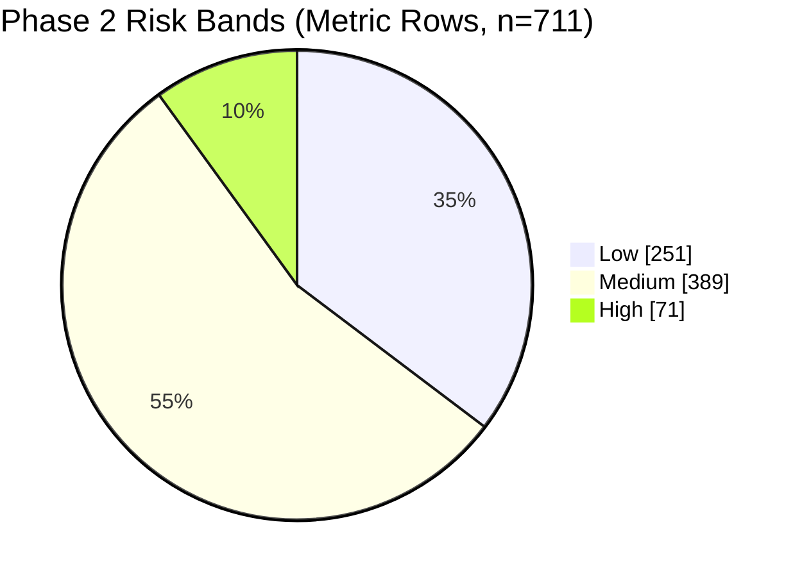

# Phase 2 Technical Documentation

## Purpose

Phase 2 transforms the Phase 1 control catalog into measurable risk metrics, scenario-based synthetic observations, optional public breach mappings, and baseline risk scores.

This document focuses on implementation details, design rationale, data contracts, and quality expectations.

## Why This Design

Phase 2 is intentionally isolated from Phase 1 to prevent accidental regression in extraction and ground-truth alignment.

Design goals:

- Preserve Phase 1 outputs as immutable inputs.
- Keep Phase 2 logic modular and testable.
- Produce reproducible baseline scoring outputs.
- Support optional public dataset enrichment without making it mandatory.

## Isolation Boundaries

Code isolation:

- All Phase 2 logic lives under `src/prert/phase2/`.
- The Phase 2 CLI entrypoint is `src/prert/cli/phase2.py`.
- Script wrapper is `scripts/run_phase2_metrics.py`.

Artifact isolation:

- Phase 2 writes only to `artifacts/phase-2/`.
- Phase 1 inputs are read from `artifacts/phase-1/controls_all.jsonl`.
- No mutation of `artifacts/phase-1/` is performed.

## Runtime Flow

1. Load controls from Phase 1 JSONL.
2. Build one metric specification per control.
3. Build coverage summary (mapped vs. missing controls).
4. Generate synthetic observations for three scenarios.
5. Score all observations and aggregate by level and scenario.
6. Optionally map public breach data to canonical fields.
7. Write outputs and manifest to `artifacts/phase-2/`.

## Current Baseline Snapshot

From the latest `phase2_manifest.json` run:

- Total controls: 237
- Mapped controls: 237
- Missing controls: 0
- Level split: user 82, system 55, organization 100
- Synthetic events: 711
- Baseline score rows: 723

## Phase 2 Visual Snapshot



| Figure                             | What it shows                                 | Result                                                               |
| ---------------------------------- | --------------------------------------------- | -------------------------------------------------------------------- |
| Phase 2 Baseline Risk Distribution | Risk-band spread from metric-level score rows | Most rows are medium risk (389), with a smaller high-risk tail (71). |

For the full cross-phase visual report and figure tables, see `09-phase1-phase2-progress-dashboard.md`.

## Module Responsibilities

- `metrics.py`: Metric creation, level classification, coverage accounting.
- `synthetic.py`: Deterministic synthetic generator with scenario profiles.
- `public_mapping.py`: Public-data ingestion and canonical mapping with quality flags.
- `scoring.py`: Metric, level, and scenario scoring plus risk banding.
- `pipeline.py`: Orchestration and artifact writing.
- `types.py`: Dataclasses for metric and observation structures.
- `io.py`: JSONL/CSV/JSON readers and writers.

## Metric Specification Model

Each control maps to one metric spec containing:

- `metric_id`: Stable hash-based ID.
- `control_id`: Phase 1 normalized control ID.
- `regulation`: Source family.
- `level`: `user`, `system`, or `organization`.
- `formula`: Level-specific score formula string.
- `required_fields`: Data prerequisites for scoring.
- `normalization_rule`: Clamp to [0, 1].
- `confidence_weight`: Derived from parser confidence and bounded in [0.1, 1.0].
- `missing_data_handling`: Penalty policy string.

### Level Classification Logic

Classification is keyword-driven over title+text.

- User keywords: consent, rights, access, transparency, etc.
- System keywords: encryption, integrity, security, breach, etc.
- Organization keywords: governance, policy, audit, management, etc.
- Fallback level is `organization` to avoid dropped controls.

## Synthetic Scenario Profiles

Three scenarios are generated for each metric:

- `normal`: lower failure and missingness, higher confidence.
- `stressed`: moderate failure and missingness.
- `adversarial`: high failure and missingness, lower confidence.

Configured profile parameters:

- `normal`: failure 0.08, missing 0.04, confidence [0.85, 0.98]
- `stressed`: failure 0.22, missing 0.12, confidence [0.72, 0.92]
- `adversarial`: failure 0.40, missing 0.20, confidence [0.55, 0.85]

## Scoring Model

Per-observation steps:

1. Raw compliance: `1 - failure_count / max(total_checks, 1)`
2. Normalize by clamp to [0, 1]
3. Missing penalty: `min(0.4, 0.05 * missing_fields)`
4. Confidence-adjusted compliance: `normalized * (1 - penalty) * observed_confidence * confidence_weight`
5. Risk score: `1 - confidence_adjusted_compliance`

Risk bands:

- `high` if risk >= 0.67
- `medium` if risk >= 0.34 and < 0.67
- `low` if risk < 0.34

### Composite Scenario Risk

Scenario summary uses weighted level compliance:

- user: 0.40
- system: 0.35
- organization: 0.25

Composite method label: `weighted_sum_v1`.

## Public Dataset Mapping

Optional public input is accepted as `.csv` or `.jsonl`.

Canonical mapped fields:

- `event_date`
- `country`
- `sector`
- `records_affected`
- `detection_to_response_hours`
- `severity`

Required fields for row validity:

- `event_date`
- `sector`
- `records_affected`

Row quality metadata:

- `dq_missing_required_fields`
- `dq_valid`

## Output Contracts

`artifacts/phase-2/metric_specs.jsonl`

- One row per mapped control.

`artifacts/phase-2/synthetic_events.jsonl`

- One row per metric x scenario.

`artifacts/phase-2/public_data_mapped.jsonl`

- Canonicalized public rows with quality flags.

`artifacts/phase-2/baseline_scores.jsonl`

- `row_type=metric`, `row_type=level_summary`, `row_type=scenario_summary`.

`artifacts/phase-2/phase2_manifest.json`

- Inputs, coverage summary, public mapping summary, and output counts.

`artifacts/phase-2/synthetic_data_dictionary.md`

- Human-readable field descriptions.

## Command Reference

Default execution:

```bash
PYTHONPATH=src python scripts/run_phase2_metrics.py
```

With public dataset:

```bash
PYTHONPATH=src python scripts/run_phase2_metrics.py \
  --public-input path/to/public_breach_data.csv
```

Custom output directory:

```bash
PYTHONPATH=src python scripts/run_phase2_metrics.py \
  --output-dir artifacts/phase-2
```

## Quality Gates

Minimum expected checks:

1. `mapped_controls == total_controls`
2. `missing_controls` is empty
3. Scores remain in [0, 1]
4. `scenario_summary_rows == 3`
5. Public mapping rows include `dq_valid`

## Test Coverage

Current Phase 2 tests validate:

- Isolated output generation and manifest creation.
- Score range constraints for compliance and risk fields.

## Limitations and Next Enhancements

Current limitations:

- Level classification is keyword-based and may need semantic refinement.
- Composite weighting is fixed (`weighted_sum_v1`).
- Public mapping is schema-alignment only; no external benchmark calibration yet.

Recommended enhancements:

1. Add semantic classifier for level assignment.
2. Add alternate composite strategies (Bayesian/hybrid).
3. Add benchmark harness with retrieval/metric quality tracking.
4. Add CI gate for manifest invariants.

---

## Navigation

[⬅ Back](07-phase2-implementation-runbook.md) | [Next ⮕](09-phase1-phase2-progress-dashboard.md)
