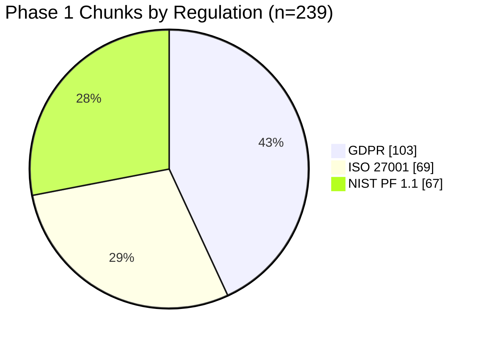
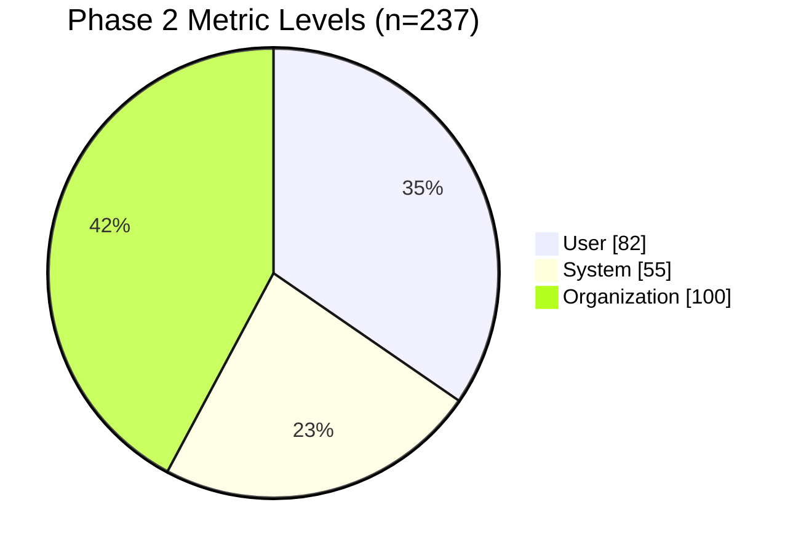
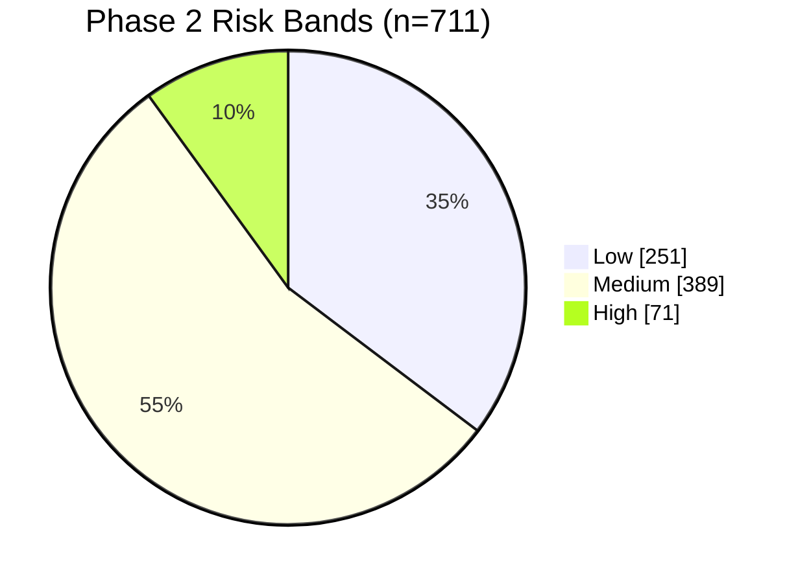

# Phase 1-2 Progress and Accuracy Dashboard

Snapshot date: 2026-04-05

## Purpose

Provide a visual and tabular status view of project progress and model quality indicators through completed Phase 1 and Phase 2 work.

## Data Sources

- `artifacts/phase-1/controls_*.jsonl`
- `artifacts/phase-1/chunks_*.jsonl`
- `artifacts/phase-2/phase2_manifest.json`
- `artifacts/phase-2/baseline_scores.jsonl`

## Executive Summary

| Area    |                            Metric |          Current Value |
| ------- | --------------------------------: | ---------------------: |
| Phase 1 |          Total controls extracted |                    237 |
| Phase 1 |            Total chunks generated |                    239 |
| Phase 1 |       Chunk inflation vs controls |                 +0.84% |
| Phase 2 |        Controls mapped to metrics |       237 / 237 (100%) |
| Phase 2 |     Synthetic metric observations |                    711 |
| Phase 2 | Public mapping validity (OPP-115) | 115 / 115 valid (100%) |
| Phase 2 |               Baseline score rows |                    723 |

## Figure Table

| Figure ID | Focus                                     | Visual Type | Key Takeaway                                                                              |
| --------- | ----------------------------------------- | ----------- | ----------------------------------------------------------------------------------------- |
| Fig 1     | Phase 1 control composition by regulation | Pie chart   | GDPR is the largest single control source (103), with ISO and NIST balanced (68/66).      |
| Fig 2     | Phase 1 chunk composition by regulation   | Pie chart   | Chunk split closely matches control split, indicating stable chunking behavior.           |
| Fig 3     | Phase 2 metric level distribution         | Pie chart   | Organization-level metrics are the largest share (100), then user (82), then system (55). |
| Fig 4     | Phase 2 risk-band distribution            | Pie chart   | Most rows are medium risk at baseline (389), with 251 low and 71 high.                    |

## Fig 1. Phase 1 Controls by Regulation

## Fig 2. Phase 1 Chunks by Regulation

## Fig 3. Phase 2 Metric Distribution by Level

## Fig 4. Phase 2 Risk-Band Distribution (Metric Rows)

## Accuracy/Quality Indicator Tables

Notes:

- Phase 1-2 currently expose quality indicators (coverage, validity, and risk stability), not supervised classification accuracy against labeled held-out sets.
- This avoids overstating model performance before Phase 3/4 benchmark protocol is complete.

### Table A. Coverage and Data Quality Indicators

| Indicator           | Definition                                                                |            Value |
| ------------------- | ------------------------------------------------------------------------- | ---------------: |
| Metric coverage     | mapped_controls / total_controls                                          | 237 / 237 (100%) |
| Missing controls    | controls with no metric mapping                                           |                0 |
| OPP-115 mapped rows | public rows ingested into canonical schema                                |              115 |
| OPP-115 valid rows  | rows passing required fields (`event_date`, `sector`, `records_affected`) | 115 / 115 (100%) |

### Table B. Scenario Stability Indicators

| Scenario    | Composite Compliance | Composite Risk | Risk Band |
| ----------- | -------------------: | -------------: | --------- |
| normal      |             0.776494 |       0.223506 | low       |
| stressed    |             0.569538 |       0.430462 | medium    |
| adversarial |             0.373206 |       0.626794 | medium    |

### Table C. Average Metric-Level Scores by Scenario

| Scenario    | Mean Confidence-Adjusted Score | Mean Risk Score |
| ----------- | -----------------------------: | --------------: |
| normal      |                         0.7757 |          0.2243 |
| stressed    |                         0.5703 |          0.4297 |
| adversarial |                         0.3705 |          0.6295 |

Interpretation:

- Risk increases monotonically from normal to stressed to adversarial.
- This trend is expected and indicates scoring sensitivity to scenario severity.

## Next Measurement Targets

1. Add held-out policy-clause classification accuracy (Phase 3).
2. Add calibration and uncertainty reporting (Phase 4).
3. Track trend lines across runs by appending this dashboard with dated snapshots.

---

## Navigation

[⬅ Back](08-phase2-technical-documentation.md) | [Next ⮕](README.md)
