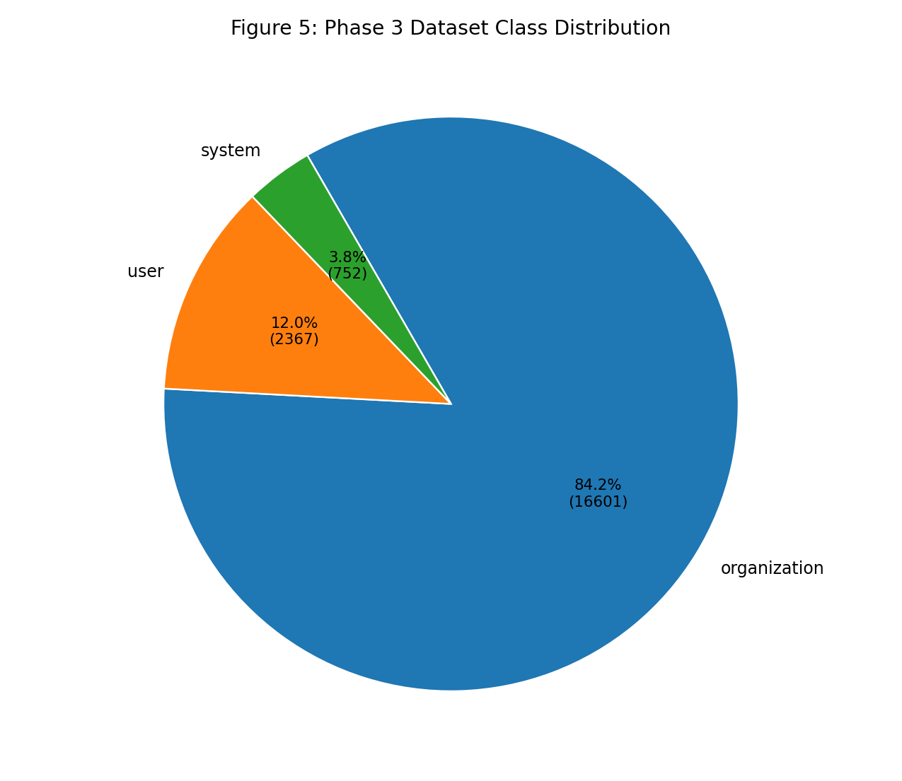
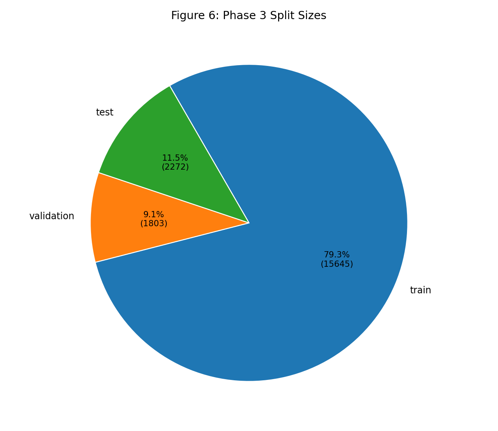
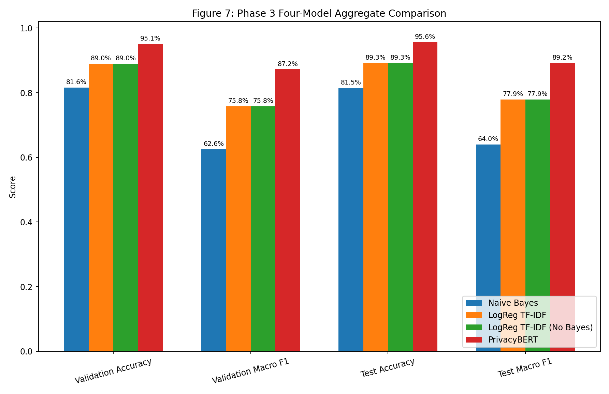
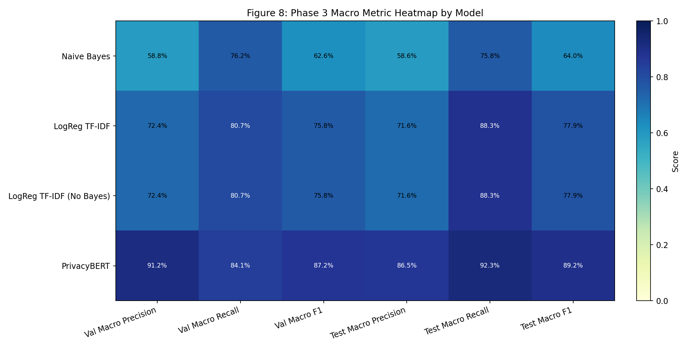
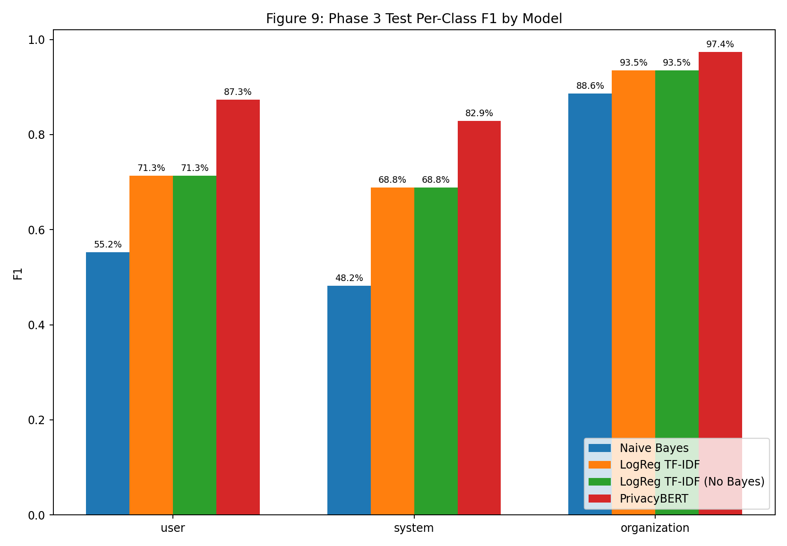
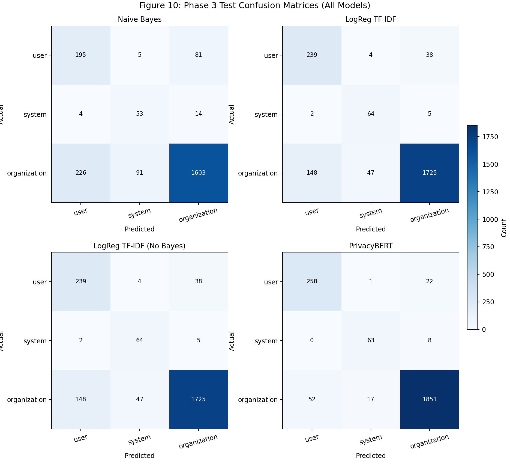
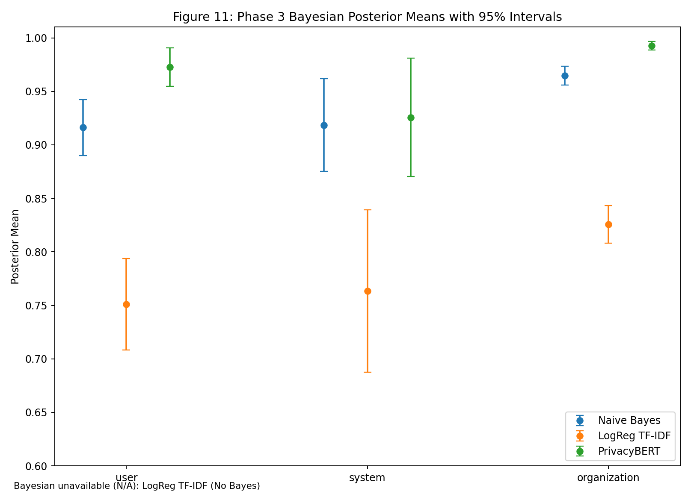
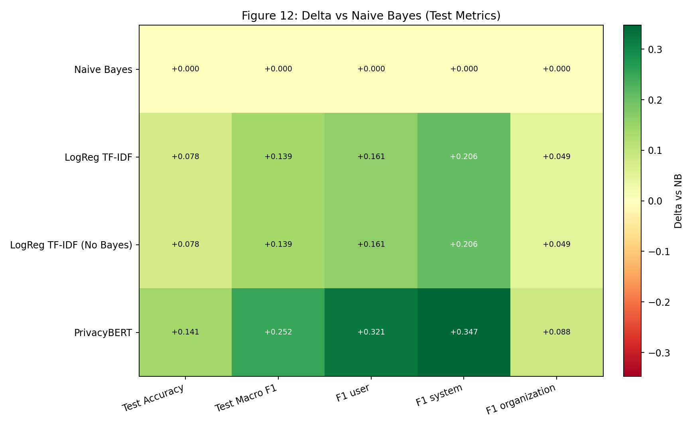

# Phase 3 Visual Dashboard

Snapshot date: 2026-04-07

## Purpose

Provide a visual and tabular status view of dataset shape, held-out classifier quality, and Bayesian posterior behavior across four Phase 3 variants:

- Baseline model: `multinomial_naive_bayes` (`phase-3-nb`)
- Upgraded model: `logreg_tfidf` (`phase-3-logreg`)
- Ablation model: `logreg_tfidf` with Bayesian scoring disabled (`phase-3-no-bayes`)
- Transformer model: `privacybert` (`phase-3-privacybert`)

Classifier metrics remain the baseline quality surface. Bayesian posterior outputs are included as a decision surface where available; no-bayes runs are marked as `N/A` by design.

## Data Sources

- `artifacts/phase-3-nb/dataset_manifest.json`
- `artifacts/phase-3-nb/classifier_metrics.json`
- `artifacts/phase-3-nb/bayesian_risk_test.json`
- `artifacts/phase-3-logreg/dataset_manifest.json`
- `artifacts/phase-3-logreg/classifier_metrics.json`
- `artifacts/phase-3-logreg/bayesian_risk_test.json`
- `artifacts/phase-3-no-bayes/dataset_manifest.json`
- `artifacts/phase-3-no-bayes/classifier_metrics.json`
- `artifacts/phase-3-privacybert/dataset_manifest.json`
- `artifacts/phase-3-privacybert/classifier_metrics.json`
- `artifacts/phase-3-privacybert/bayesian_risk_test.json`

## Executive Summary

| Area     | Metric                                    |                                            Current Value |
| -------- | ----------------------------------------- | -------------------------------------------------------: |
| Dataset  | Total rows                                |                                                    19720 |
| Dataset  | Class mix (org/system/user)               | 84.18% / 3.81% / 12.00% (0.841836 / 0.038134 / 0.120030) |
| Split    | Train / Validation / Test                 | 79.34% / 9.14% / 11.52% (0.793357 / 0.091430 / 0.115213) |
| Model    | NB test accuracy / macro F1               |                    81.47% / 64.01% (0.814701 / 0.640117) |
| Model    | LogReg test accuracy / macro F1           |                    89.26% / 77.90% (0.892606 / 0.779024) |
| Model    | No-Bayes test accuracy / macro F1         |                    89.26% / 77.90% (0.892606 / 0.779024) |
| Model    | PrivacyBERT test accuracy / macro F1      |                    95.60% / 89.20% (0.955986 / 0.891999) |
| Delta    | LogReg vs NB (test accuracy / macro F1)   |                 +7.79% / +13.89% (+0.077905 / +0.138907) |
| Delta    | No-Bayes vs NB (test accuracy / macro F1) |                 +7.79% / +13.89% (+0.077905 / +0.138907) |
| Delta    | PrivacyBERT vs NB (accuracy / macro F1)   |                +14.13% / +25.19% (+0.141285 / +0.251882) |
| Bayesian | Test posterior overall (NB/LogReg/NoB/PB) |                     0.952613 / 0.809707 / N/A / 0.987510 |
| Leakage  | Policy overlap (all split pairs)          |                                                        0 |

## Figure Table

| Figure ID | Figure Preview                                                             | Key Takeaway                                                                                                              |
| --------- | -------------------------------------------------------------------------- | ------------------------------------------------------------------------------------------------------------------------- |
| Fig 5     |                      | Corpus remains organization-heavy, so macro and per-class metrics are still required for fair model comparison.           |
| Fig 6     |                             | Train-heavy split is stable for learning while preserving validation/test hold-outs with zero policy overlap.             |
| Fig 7     |           | PrivacyBERT leads aggregate quality; LogReg and No-Bayes are classifier-identical and both improve over NB.               |
| Fig 8     |               | Heatmap highlights strongest macro precision/recall/F1 concentration in PrivacyBERT and mid-tier gains from LogReg.       |
| Fig 9     |                       | Minority-class F1 gains are largest when moving from NB to LogReg/PrivacyBERT, especially on `system`.                    |
| Fig 10    |  | Confusion small multiples show spillover reduction from NB to LogReg and strongest diagonal concentration in PrivacyBERT. |
| Fig 11    |           | Bayesian posterior means/intervals separate model uncertainty profiles; No-Bayes is intentionally excluded as N/A.        |
| Fig 12    |                    | Delta map makes improvement vs NB explicit and shows that classifier gains for LogReg and No-Bayes are identical.         |

## Fig 5. Dataset Class Distribution


What this means:

- The corpus is still strongly organization-heavy.
- Majority-class strength can hide minority regressions; per-class and macro views remain mandatory.

## Fig 6. Split Size Profile


What this means:

- The split is suitable for stable training plus held-out evaluation.
- `policy_overlap.* == 0` confirms policy-level leakage protection.

## Fig 7. Four-Model Aggregate Comparison


What this means:

- `privacybert` is highest on validation and test for both accuracy and macro F1.
- `logreg_tfidf` and `logreg_tfidf (no bayes)` have matching classifier bars, confirming Bayesian disablement affects scoring surface, not classifier output.
- Both LogReg variants materially outperform NB on held-out aggregate quality.

## Fig 8. Macro Metric Heatmap by Model


What this means:

- Heat concentration shifts upward from NB -> LogReg -> PrivacyBERT across macro precision/recall/F1.
- No-Bayes mirrors LogReg heat cells exactly on classifier metrics, reinforcing that the ablation only removes posterior scoring artifacts.
- PrivacyBERT delivers strongest minority-sensitive macro profile on both validation and test.

## Fig 9. Test Per-Class F1 by Model


What this means:

- NB remains lowest for all classes, with biggest gap on `system`.
- LogReg and No-Bayes are identical: user 71.34% (0.713433), system 68.82% (0.688172), organization 93.55% (0.935466).
- PrivacyBERT is best on all classes: user 87.31% (0.873096), system 82.89% (0.828947), organization 97.40% (0.973954).

## Fig 10. Test Confusion Matrices (All Models)


What this means:

- NB shows the highest organization -> user/system spillover.
- LogReg and No-Bayes reduce spillover and increase minority true positives versus NB.
- PrivacyBERT has the strongest diagonal concentration, indicating best class separation.

## Fig 11. Bayesian Posterior Means with 95% Intervals


What this means:

- PrivacyBERT has the highest posterior means across user/system/organization levels with tight intervals.
- NB posterior means are stronger than LogReg posterior means in this run despite lower classifier metrics, emphasizing that posterior evidence scoring can rank runs differently from classifier accuracy.
- No-Bayes is intentionally N/A for this figure because Bayesian scoring artifacts are not produced when posterior scoring is disabled.

## Fig 12. Delta vs Naive Bayes (Test Metrics)


What this means:

- All non-baseline models are positive vs NB across aggregate and per-class F1 metrics.
- LogReg and No-Bayes have equal deltas everywhere (same classifier outputs).
- PrivacyBERT produces the largest gains, especially for minority classes.

## Held-Out Quality Indicator Tables

### Table A. Aggregate Held-Out Metrics by Model

| Model                      | Split      | Rows |          Accuracy |          Macro F1 |
| -------------------------- | ---------- | ---: | ----------------: | ----------------: |
| multinomial_naive_bayes    | Validation | 1803 | 81.64% (0.816417) | 62.59% (0.625907) |
| multinomial_naive_bayes    | Test       | 2272 | 81.47% (0.814701) | 64.01% (0.640117) |
| logreg_tfidf               | Validation | 1803 | 88.96% (0.889628) | 75.80% (0.757970) |
| logreg_tfidf               | Test       | 2272 | 89.26% (0.892606) | 77.90% (0.779024) |
| logreg_tfidf (no bayesian) | Validation | 1803 | 88.96% (0.889628) | 75.80% (0.757970) |
| logreg_tfidf (no bayesian) | Test       | 2272 | 89.26% (0.892606) | 77.90% (0.779024) |
| privacybert                | Validation | 1803 | 95.12% (0.951192) | 87.24% (0.872441) |
| privacybert                | Test       | 2272 | 95.60% (0.955986) | 89.20% (0.891999) |

### Table B. Test Per-Class F1 by Model

| Label        |             NB F1 |         LogReg F1 |       No-Bayes F1 |    PrivacyBERT F1 |
| ------------ | ----------------: | ----------------: | ----------------: | ----------------: |
| user         | 55.24% (0.552408) | 71.34% (0.713433) | 71.34% (0.713433) | 87.31% (0.873096) |
| system       | 48.18% (0.481818) | 68.82% (0.688172) | 68.82% (0.688172) | 82.89% (0.828947) |
| organization | 88.61% (0.886125) | 93.55% (0.935466) | 93.55% (0.935466) | 97.40% (0.973954) |

### Table C. Bayesian Posterior Summary (Test)

| Model                      | Overall Posterior Mean |            User Mean [95% CI] |          System Mean [95% CI] |    Organization Mean [95% CI] |
| -------------------------- | ---------------------: | ----------------------------: | ----------------------------: | ----------------------------: |
| multinomial_naive_bayes    |               0.952613 | 0.916301 [0.890126, 0.942477] | 0.918496 [0.875283, 0.961709] | 0.964695 [0.955930, 0.973460] |
| logreg_tfidf               |               0.809707 | 0.751016 [0.708318, 0.793714] | 0.763389 [0.687348, 0.839430] | 0.825634 [0.807973, 0.843295] |
| logreg_tfidf (no bayesian) |                    N/A |                           N/A |                           N/A |                           N/A |
| privacybert                |               0.987510 | 0.972697 [0.954701, 0.990694] | 0.925694 [0.870264, 0.981124] | 0.992613 [0.988749, 0.996478] |

## Next Measurement Targets

1. Add calibration visuals (reliability curves + expected calibration error) for all four classifier variants.
2. Add threshold-sensitivity sweeps focused on minority-class precision/recall operating points.
3. Add bootstrap confidence bands for classifier metrics to quantify sampling uncertainty between close variants.
4. Add dated run trend snapshots to monitor drift and ranking stability over time.

Regeneration command:

```bash
PYTHONPATH=src python scripts/generate_phase3_dashboard_figures.py
```

---

## Navigation

[⬅ Back](10-phase3-implementation-runbook.md) | [Next ⮕](README.md)
