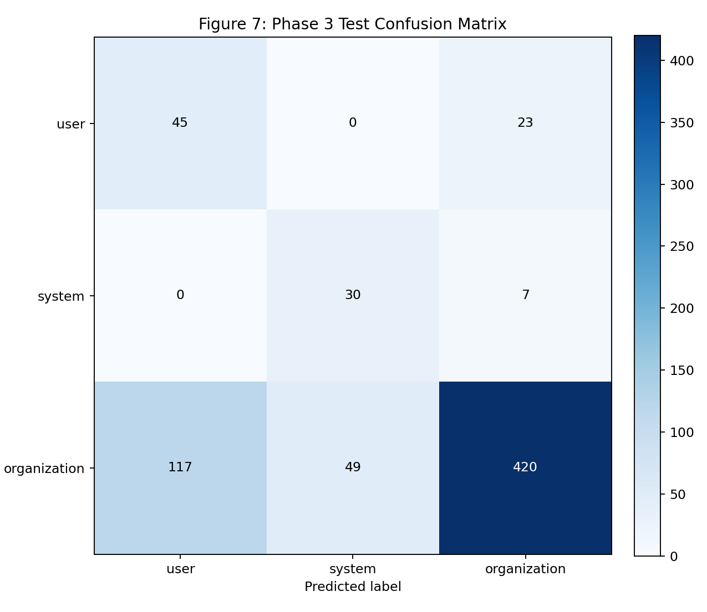
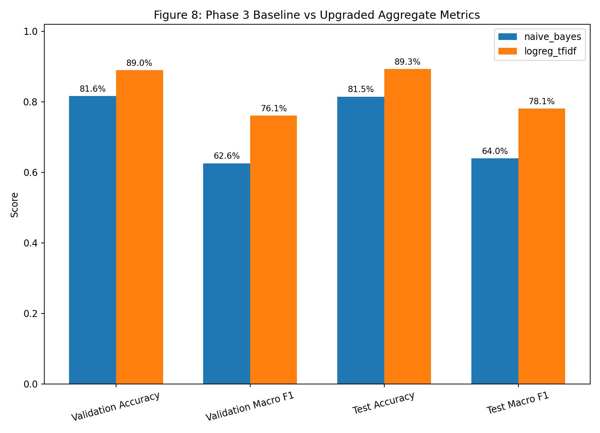
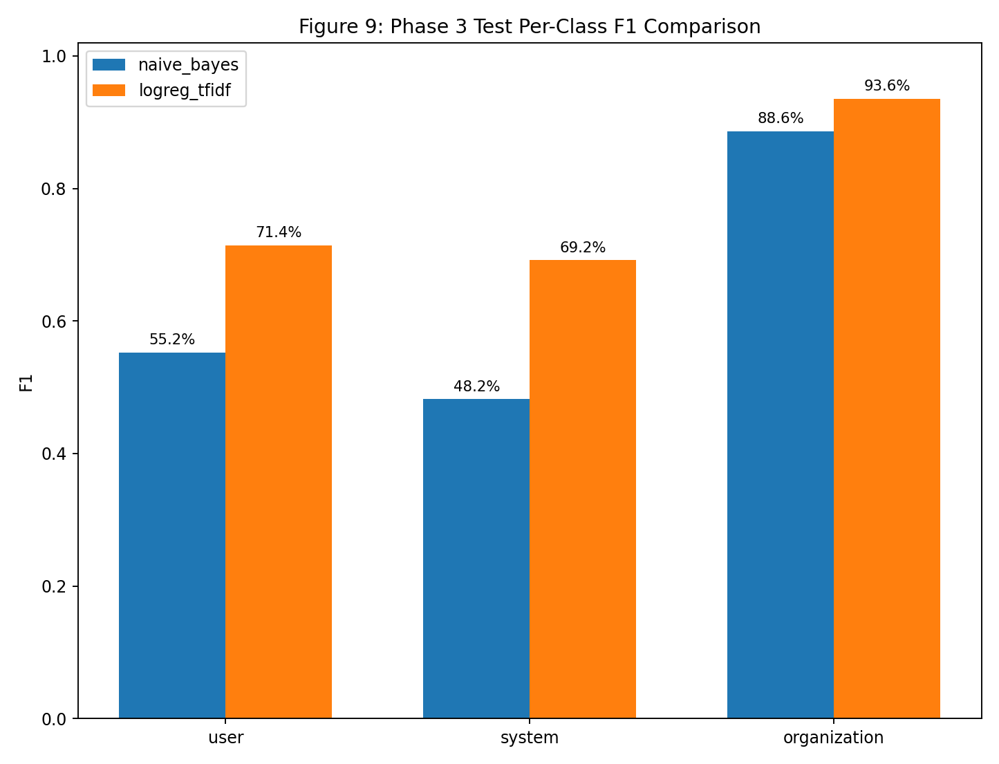
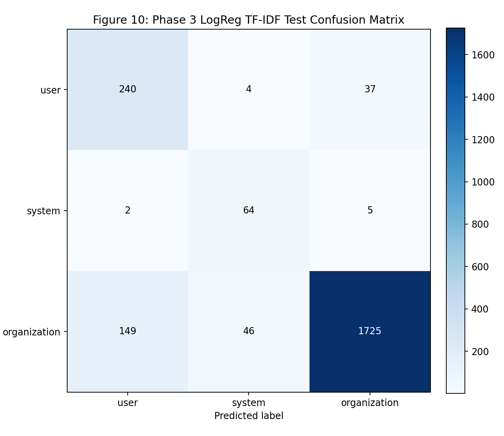

# Phase 3 Visual Dashboard

Snapshot date: 2026-04-05

## Purpose

Provide a visual and tabular status view of dataset shape and held-out classifier quality for both:

- Baseline model: `multinomial_naive_bayes`
- Upgraded model: `logreg_tfidf`

This dashboard currently emphasizes classifier benchmark visuals. Bayesian posterior risk outputs are now produced by the pipeline and should be treated as the primary scoring surface for Phase 3 decisioning.

## Data Sources

- `artifacts/phase-3-nb/dataset_manifest.json`
- `artifacts/phase-3-nb/classifier_metrics.json`
- `artifacts/phase-3-logreg/dataset_manifest.json`
- `artifacts/phase-3-logreg/classifier_metrics.json`
- `artifacts/phase-3/bayesian_risk_validation.json` (default Bayesian-enabled runs)
- `artifacts/phase-3/bayesian_risk_test.json` (default Bayesian-enabled runs)

## Executive Summary

| Area     | Metric                                   |                                            Current Value |
| -------- | ---------------------------------------- | -------------------------------------------------------: |
| Dataset  | Total rows                               |                                                    19720 |
| Dataset  | Class mix (org/system/user)              | 84.18% / 3.81% / 12.00% (0.841836 / 0.038134 / 0.120030) |
| Split    | Train / Validation / Test                | 79.34% / 9.14% / 11.52% (0.793357 / 0.091430 / 0.115213) |
| Model    | Baseline test accuracy                   |                                        81.47% (0.814701) |
| Model    | Upgraded test accuracy                   |                                        89.30% (0.893046) |
| Model    | Baseline test macro F1                   |                                        64.01% (0.640117) |
| Model    | Upgraded test macro F1                   |                                        78.06% (0.780633) |
| Delta    | Test accuracy gain (upgraded - baseline) |                                        7.83% (+0.078345) |
| Delta    | Test macro F1 gain (upgraded - baseline) |                                       14.05% (+0.140516) |
| Bayesian | Primary metric surface                   |                `bayesian_posterior` (enabled by default) |
| Leakage  | Policy overlap (all split pairs)         |                                                        0 |

## Figure Table

| Figure ID | Figure Preview                                                    | Key Takeaway                                                                                          |
| --------- | ----------------------------------------------------------------- | ----------------------------------------------------------------------------------------------------- |
| Fig 5     |             | Dataset remains organization-heavy; macro metrics and per-class metrics must be interpreted together. |
| Fig 6     |                    | Split profile remains train-heavy while preserving held-out validation and test partitions.           |
| Fig 7     |          | Naive Bayes has visible confusion from organization into user/system classes.                         |
| Fig 8     |       | Upgraded TF-IDF + logistic regression improves both validation and test aggregate metrics.            |
| Fig 9     |  | Test F1 improves across all classes, with largest gain on minority classes.                           |
| Fig 10    |  | Upgraded model reduces majority-class spillover and improves minority-class hit counts.               |

## Fig 5. Dataset Class Distribution


What this means:

- The corpus is still strongly organization-heavy.
- Per-class indicators are required to avoid majority-class overconfidence.

## Fig 6. Split Size Profile


What this means:

- The split is suitable for stable training plus held-out evaluation.
- `policy_overlap.* == 0` confirms policy-level leakage protection.

## Fig 7. Naive Bayes Test Confusion Matrix


What this means:

- Correct organization predictions are high in absolute count, but many organization clauses shift into user/system.
- Minority-class recall is acceptable, but precision remains limited.

## Fig 8. Aggregate Metric Comparison


What this means:

- Upgraded `logreg_tfidf` outperforms baseline on validation and test for both accuracy and macro F1.
- Improvements transfer from validation to test, indicating a meaningful generalization gain.

## Fig 9. Test Per-Class F1 Comparison


What this means:

- User class F1 improves from 55.24% (0.552408) to 71.43% (0.714286).
- System class F1 improves from 48.18% (0.481818) to 69.19% (0.691892).
- Organization class F1 improves from 88.61% (0.886125) to 93.57% (0.935720).

## Fig 10. LogReg TF-IDF Test Confusion Matrix


What this means:

- Correct predictions increase for all classes versus baseline.
- Organization->user/system spillover is reduced relative to baseline confusion.

## Held-Out Quality Indicator Tables

### Table A. Aggregate Held-Out Metrics by Model

| Model                   | Split      | Rows |          Accuracy |          Macro F1 |
| ----------------------- | ---------- | ---: | ----------------: | ----------------: |
| multinomial_naive_bayes | Validation | 1803 | 81.64% (0.816417) | 62.59% (0.625907) |
| multinomial_naive_bayes | Test       | 2272 | 81.47% (0.814701) | 64.01% (0.640117) |
| logreg_tfidf            | Validation | 1803 | 88.96% (0.889628) | 76.10% (0.760958) |
| logreg_tfidf            | Test       | 2272 | 89.30% (0.893046) | 78.06% (0.780633) |

### Table B. Test Per-Class F1 by Model

| Label        |    Naive Bayes F1 |  LogReg TF-IDF F1 |               Delta |
| ------------ | ----------------: | ----------------: | ------------------: |
| user         | 55.24% (0.552408) | 71.43% (0.714286) | +16.19% (+0.161878) |
| system       | 48.18% (0.481818) | 69.19% (0.691892) | +21.01% (+0.210074) |
| organization | 88.61% (0.886125) | 93.57% (0.935720) |  +4.96% (+0.049595) |

## Next Measurement Targets

1. Add Bayesian posterior visuals (per-level posterior means and interval bands).
2. Add calibration visuals (reliability curve and expected calibration error) for both classifier and posterior outputs.
3. Add threshold-sensitivity analysis for minority-class precision/recall tradeoffs.
4. Add dated run trend snapshots to monitor stability and drift.

Regeneration command:

```bash
PYTHONPATH=src python3 scripts/generate_phase3_dashboard_figures.py
```

---

## Navigation

[⬅ Back](10-phase3-implementation-runbook.md) | [Next ⮕](README.md)
